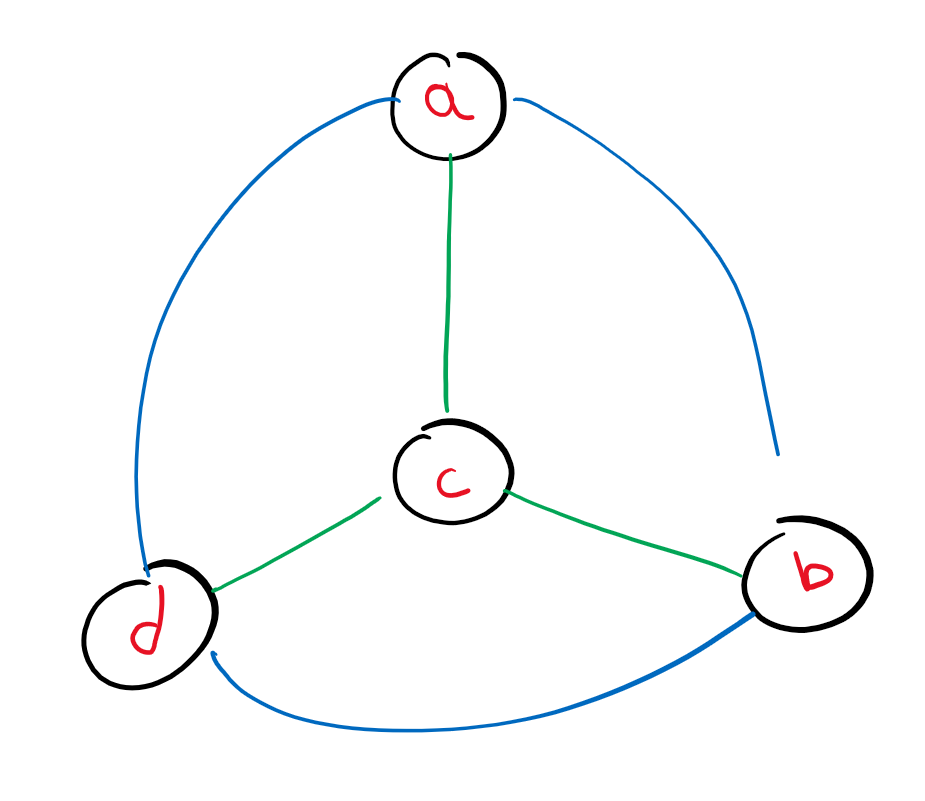
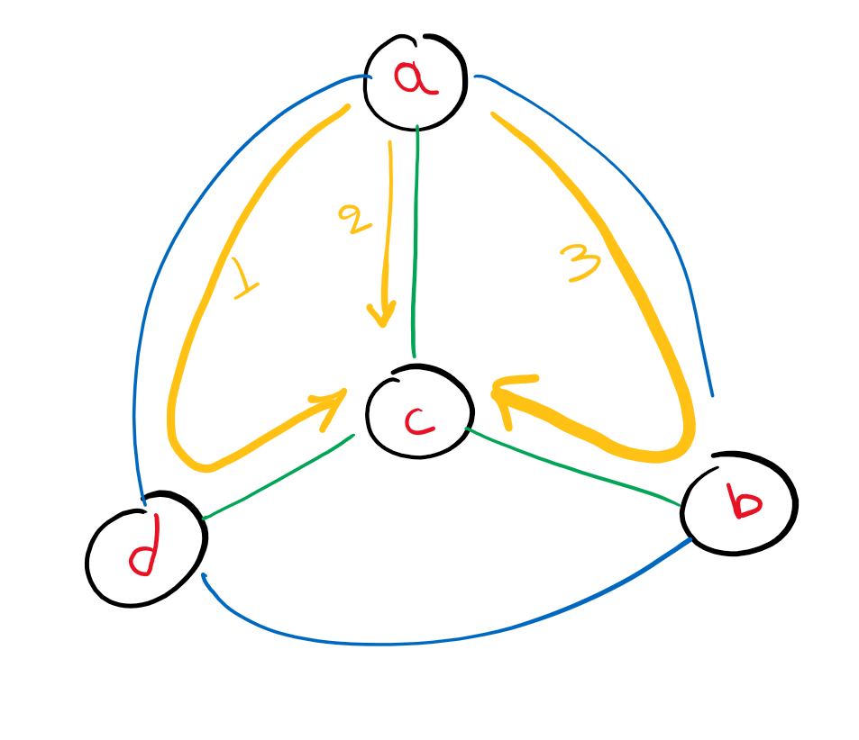

# Ερώτηση 2
#### Πούλος Βασίλης, 2805.
#### Κωστάκης Ελευθέριος-Παναγιώτης, 2741.
## Ερώτημα 1
Η ελάχιστη δυνατή ρόδα είναι η $W_4$ με κ = 4
όπως φαίνεται στη παρακάτω εικόνα.

Ορίσαμε ως $C(f)$ το κόστος ανάθεσης που είναι το πλήθος τον αποστάσεων
μεταξύ των δύο κόμβων στους οποίους έχουν τοποθετηθεί δύο αντικείμενα.
Επομένως έχοντας ως βάση την ελάχιστη ρόδα μπορούμε να παρατηρίσουμε οτι
στο υπογράφημα αστέρι $S_4$ οποιοσδήποτε κόμβος εχει μόνο μία 
διαδρομή πρός οποιονδήποτε άλλο κόμβο. 

Στο γράφημα $W_4$ η βέλτιστη 
ανάθεση έχει 3 δυνατές διαδρομές όπως φαίνεται παρακάτω.

Αυτό μπορεί να γραφεί $C_W = 3C_S$ αφού $C_S = 1, C_W =3$.

Στην συνέχεια αν έχουμε ρόδα με $k > 4$ (η πάρουμε την
χείριστη ανάθεση) παρατηρούμε οτι στο $S_k$ η διαδρομή απο εναν κόμβο
$u$ σε έναν $v$ είναι μοναδική ενώ σε ολόκληρο το γράφημα $W_k$ οι 
διαδρομές αυξάνονται συνεπώς ισχύει και η ανισότητα $C_W < 3C_S$. 